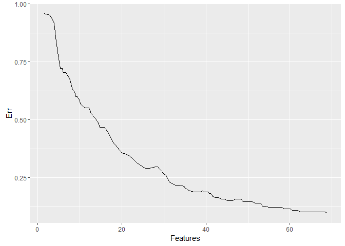
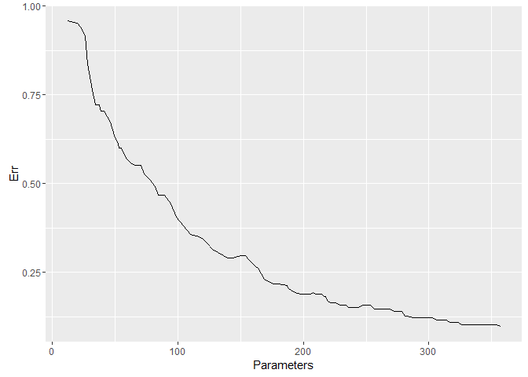

Plotting the Expected Generalization Error (for msgl version 2.3.8)
-------------------------------------------------------------------

### 1. Load the msgl library in R

``` r
library(msgl)
```

### 2. Load your data

Load data containing N samples and p features (covariates):

``` r
x <- # load design matrix (of size N x p)
classes <- # load class labels (a vector of size N)
```

For the purpose of this tutorial we will load a data set consisting of microRNA normalized expression measurements of primary cancer samples.

``` r
data(PrimaryCancers)
x[1:5,1:5]
```

    ##              let.7a     let.7c     let.7d     let.7e       let.7f
    ## P-544-ME -1.1052510 -0.9213983 -0.7200146 -0.9448098 -0.591417505
    ## P-554-NW -1.0956835 -1.0879221 -0.6100223 -0.9538088 -0.554779014
    ## P-559-OI -1.1271169 -1.0914447 -0.6889379 -1.0823322 -0.736167409
    ## P-564-MO -1.2465982 -1.2719367 -0.7614792 -1.2006796 -0.784319518
    ## P-579-MY -0.6194332 -0.4971233 -0.5169694 -0.9004003  0.009509523

``` r
dim(x)
```

    ## [1] 165 371

``` r
table(classes)
```

    ## classes
    ##    Breast       CCA Cirrhosis       CRC        EG       HCC     Liver 
    ##        17        20        17        20        18        17        20 
    ##  Pancreas  Squamous 
    ##        20        16

### 3. Estimate error using cross validation

Choose `lambda` (fraction of lambda.max) and `alpha`, with `alpha = 1` for lasso, `alpha = 0` for group lasso and `alpha` in the range (0,1) for spares group lasso.

Use `msgl::cv` to estimate the error for each lambda in a sequence decreasing from the data derived *lambda max* to `lambda` \* *lambda max*. Lambda max is the lambda at which the first penalized parameter becomes non-zero. A smaller `lambda` will take longer to fit and include more features. The following command will run a 10 fold cross validation for each lambda value in the lambda sequence using 2 parallel units (using the [foreach](https://CRAN.R-project.org/package=foreach) and [doParallel](https://CRAN.R-project.org/package=doParallel) packages.

``` r
cl <- makeCluster(2)
registerDoParallel(cl)

fit.cv <- msgl::cv(x, classes, fold = 10, alpha = 0.5, lambda = 0.1, use_parallel = TRUE)
```

    ## Running msgl 10 fold cross validation (dense design matrix)
    ## 
    ##  Samples:  Features:  Classes:  Groups:  Parameters: 
    ##        165        372         9      372       3.348k

``` r
stopCluster(cl)
```

### 4. Extracting the error and number of features used in the models

We may extract the expected generalization error for each of the 100 models using `Err`:

``` r
# Error for the first 10 models
Err(fit.cv)[1:10]
```

    ##  [1] 0.9575758 0.9515152 0.9393939 0.9151515 0.8363636 0.7636364 0.7212121
    ##  [8] 0.7212121 0.7030303 0.7030303

The number of features used in the models may be extracted using `features_stat`:

``` r
# Number of features used in the fist 10 models (one row for each cross validation set)
features_stat(fit.cv)[,1:10]
```

    ##               [,1] [,2] [,3] [,4] [,5] [,6] [,7] [,8] [,9] [,10]
    ## sample-set-1     2    4    5    5    5    5    6    7    9     9
    ## sample-set-2     1    3    3    4    4    5    5    6    6     6
    ## sample-set-3     2    5    5    7    7    8    9    9   10    11
    ## sample-set-4     2    2    3    4    4    4    4    4    4     4
    ## sample-set-5     1    2    2    2    3    5    6    6    6     7
    ## sample-set-6     2    3    4    4    6    6    7    8    8     8
    ## sample-set-7     2    3    3    4    5    5    5    7    7    10
    ## sample-set-8     2    2    2    2    2    4    3    3    3     4
    ## sample-set-9     1    2    2    3    3    3    3    3    3     3
    ## sample-set-10    1    3    5    5    5    5    6    6    6     6

``` r
# Expected number of features used in the fist 10 models
colMeans(features_stat(fit.cv))[1:10]
```

    ##  [1] 1.6 2.9 3.4 4.0 4.4 5.0 5.4 5.9 6.2 6.8

The number of parameters used in the models may be extracted using `parameters_stat`:

``` r
# Number of features used in the fist 10 models (one row for each cross validation set)
parameters_stat(fit.cv)[,1:10]
```

    ##               [,1] [,2] [,3] [,4] [,5] [,6] [,7] [,8] [,9] [,10]
    ## sample-set-1    15   29   33   33   33   33   39   45   51    51
    ## sample-set-2     9   19   19   23   23   29   29   37   37    37
    ## sample-set-3    17   36   36   48   48   53   59   59   64    69
    ## sample-set-4    14   14   20   26   26   26   26   27   27    27
    ## sample-set-5     9   13   13   13   18   29   37   36   36    39
    ## sample-set-6    13   20   24   24   36   35   40   46   47    48
    ## sample-set-7    13   22   22   28   33   33   34   42   43    55
    ## sample-set-8    13   13   13   13   14   26   19   20   20    25
    ## sample-set-9     9   13   13   20   20   21   21   21   21    21
    ## sample-set-10    9   20   30   31   31   31   40   40   40    40

``` r
# Expected number of features used in the fist 10 models
colMeans(parameters_stat(fit.cv))[1:10]
```

    ##  [1] 12.1 19.9 22.3 25.9 28.2 31.6 34.4 37.3 38.6 41.2

### 5. Plotting the error

``` r
library(ggplot2)
```

Make a data.frame for plotting

``` r
plot_df <- data.frame(
  Err = Err(fit.cv),
  Features = colMeans(features_stat(fit.cv)),
  Parameters = colMeans(parameters_stat(fit.cv))
)
```

Plot the expected error vs expected number of features

``` r
ggplot(plot_df, aes(y = Err, x = Features)) +
  geom_path()
```



Plot the expected error vs expected number of parameters

``` r
ggplot(plot_df, aes(y = Err, x = Parameters)) +
  geom_path()
```


